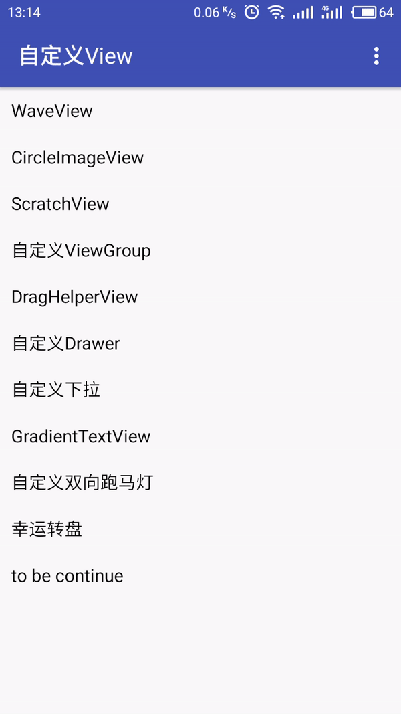
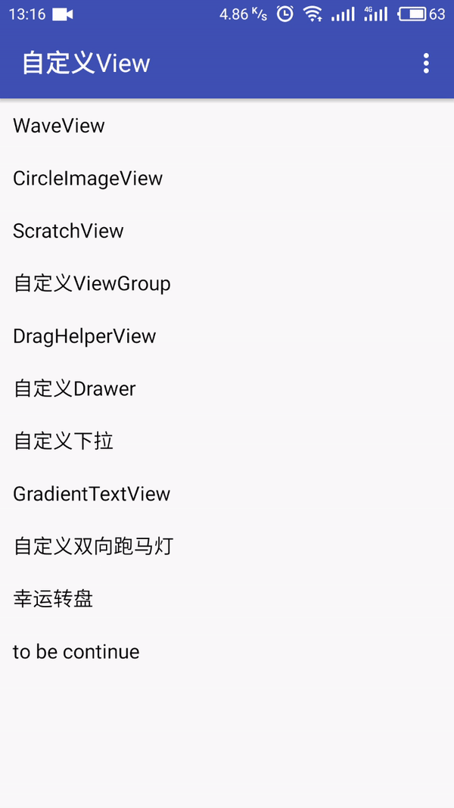
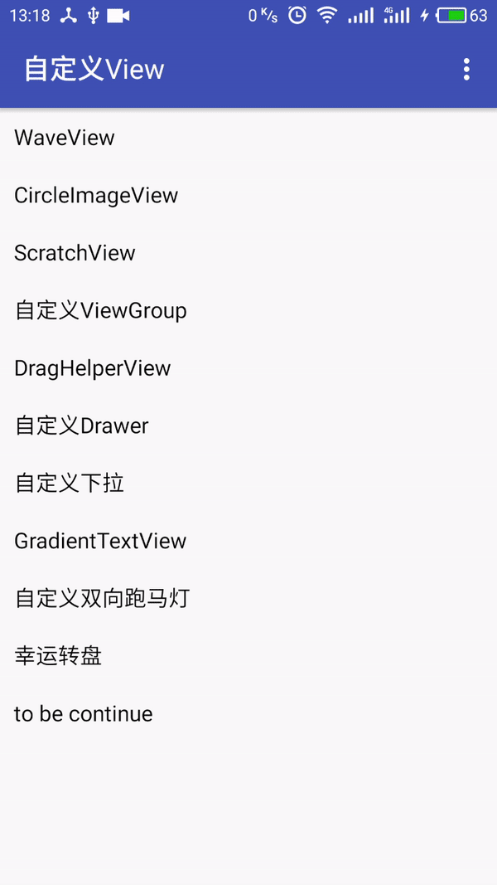

# CustomizedViews
无聊写的自定义View的Demo，进阶学习用

WaveView 波浪形进度条

刮奖 抽奖 券

DragHelperView 使用Demo

自定义DrawerLayout

自定义下拉的DrawerLayout

自定义渐变颜色的TextView

自定义跑马灯 设置横向滚动速度  纵向滚动速度  纵向滚动间隔
如果横向宽度超过view宽度，先横向滚动，滚动结束，间隔一段时间，纵向滚动

自定义抽奖 转盘，可以指定转到哪一个，可以随机结果，可以按百分比设置结果
可以添加转盘选项

